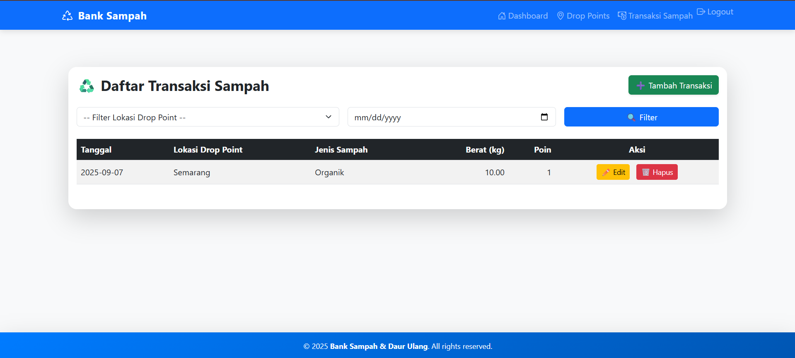

# Bank Sampah - Sistem Monitoring dan Manajemen Sampah Terintegrasi

## Deskripsi Singkat
Bank Sampah adalah aplikasi web yang dirancang untuk mengelola dan memonitor aktivitas pengumpulan sampah secara terpusat. Aplikasi ini membantu petugas dan pengelola bank sampah dalam pencatatan transaksi, pengelolaan drop points, dan pemantauan status nasabah secara real-time untuk mendukung pengelolaan lingkungan yang lebih baik.

## Fitur Utama
- Manajemen data nasabah bank sampah.
- Pencatatan transaksi penyetoran dan penarikan sampah secara digital.
- Monitoring lokasi drop points sampah.
- Dashboard interaktif dengan laporan realtime.
- Autentikasi user dengan role user.
- Responsive UI berbasis Bootstrap 5.
- Logout dan proteksi akses dengan Laravel Breeze authentication.

## Arsitektur Singkat
Aplikasi ini dibangun dengan Laravel Framework sebagai backend dan Bootstrap 5 untuk frontend. Database menggunakan MySQL dengan tabel utama seperti:

- `users`: menyimpan data user dan guest.
- `drop_points`: menyimpan lokasi penampungan sampah.
- `transactions`: mencatat transaksi sampah per user.
  
## Diagram Hubungan Entitas (ERD) singkat:
- users
- |--< transactions
- drop_points
- |--< transactions

## Cara Menjalankan Lokal

1. Clone repository:
- ```git clone https://github.com/taufik-note/Bank-Sampah.git```
- ```cd Bank-Sampah```

2. Install dependensi:
- ```composer install```
- ```npm install```
- ```npm run dev```

3. Konfigurasi environment:
- ```cp .env.example .env```
- ```php artisan key:generate```

4. Migrasi database:
- ```php artisan migrate```

5. Jalankan server lokal:
- ```php artisan serve```

6. Gunakan akun demo atau register user baru untuk login. Untuk akses cepat, gunakan fitur Guest Login.

## Tangkapan Layar / Demo

  
*Dashboard utama monitoring transaksi dan drop points.*

  
*Form input dan riwayat transaksi nasabah.*

  
*Form input lokasi drop.*

## Keputusan Teknis & Alasan

- Laravel Framework digunakan untuk kestabilan, keamanan, dan kemudahan pengembangan backend.
- Bootstrap 5 dipilih untuk tampilan responsif dan cepat.
- MySQL sebagai basis data yang populer dan andal.
- Laravel Breeze untuk autentikasi yang ringan dan mudah dikustomisasi.
- Guest Login mempercepat akses demo tanpa perlu registrasi penuh.

## Sumber Data / API
Aplikasi ini menggunakan data internal tanpa integrasi API eksternal. Data transaksi dan pengguna dikelola penuh di database lokal.


